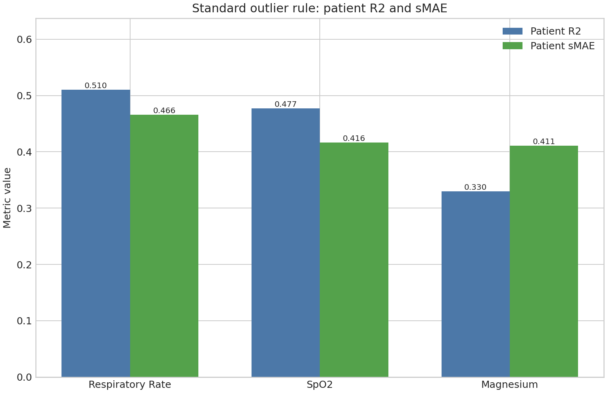
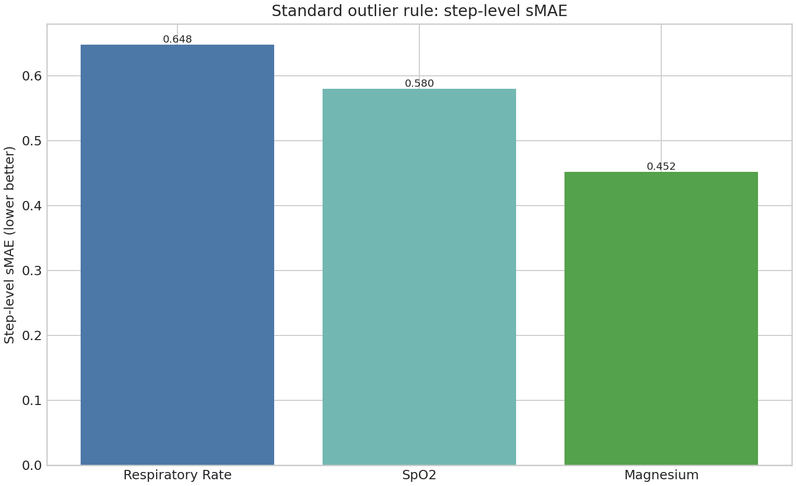
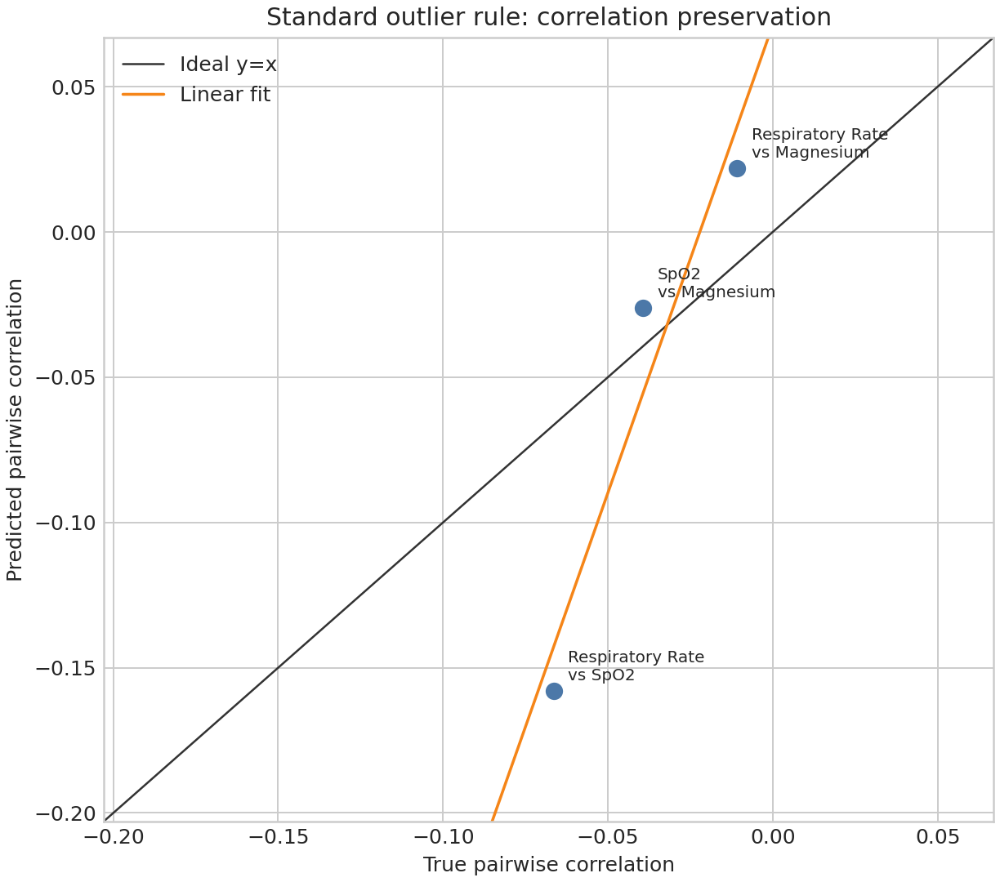

# MIMIC DoRA Paper-R2 vLLM Evaluation Metrics — job 40131 (30 samples)

Source logs: `logs/mimic_dora_paper_r2_vllm_shard_40131_*.out`  
All 8 shards report `Num samples to generate: 30` and saved target/prediction CSVs.

Outlier rule from `memory.md`: exclude rows with `abs(target) > 1000.0` before metric calculation.

## R2 correlation / paper-style correlation preservation

- Definition in `plot/r2_metric_definitions.md`: `R2_corr = -5.217115`
- Scatter-fit alternative (`corr(c_true, c_pred)^2`, useful because paper figure is a scatter with fit): `0.924896`
- Correlation between the two 3-point correlation vectors: `0.961715`

| pair                          |   rows |   true_corr |   pred_corr |      diff |
|:------------------------------|-------:|------------:|------------:|----------:|
| Respiratory Rate vs SpO2      |  98238 |   -0.066436 |   -0.157892 | -0.091455 |
| Respiratory Rate vs Magnesium |   6728 |   -0.010806 |    0.022072 |  0.032877 |
| SpO2 vs Magnesium             |   6665 |   -0.039346 |   -0.026024 |  0.013322 |

## Step-level sMAE

| variable         |   rows |   mae_scaled |     smae |   r2_step |
|:-----------------|-------:|-------------:|---------:|----------:|
| Respiratory Rate | 101083 |     0.647648 | 0.647648 |  0.103775 |
| SpO2             |  99598 |     0.579725 | 0.579725 |  0.286384 |
| Magnesium        |   6929 |     0.451821 | 0.451821 |  0.381289 |
| Unweighted mean  | 207610 |     0.559732 | 0.559732 |           |
| Weighted mean    | 207610 |     0.608527 | 0.608527 |           |

## Patient-averaged R2 / sMAE

| variable         |   patients |   r2_patient |   raw_mae |   true_patient_avg_std |     smae |
|:-----------------|-----------:|-------------:|----------:|-----------------------:|---------:|
| Respiratory Rate |       5520 |     0.510057 |  0.368719 |               0.79129  | 0.465972 |
| SpO2             |       5507 |     0.477341 |  0.357433 |               0.858514 | 0.416339 |
| Magnesium        |       4322 |     0.33012  |  0.395696 |               0.963151 | 0.410835 |

<!-- CHINESE_SUMMARY_AND_FIGURES:START -->
---

## 中文重點解讀與圖表

本次結果來自 job `40131` 的 8 個 vLLM shard；每個 shard 都是 `Num samples to generate: 30`。以下採用 `memory.md` 的標準 outlier 規則：先移除 `abs(target) > 1000` 的不合理目標值。

### 一句話結論

- **sMAE 已經接近 paper 報告區間**：未加權 step-level sMAE = `0.559732`，加權 step-level sMAE = `0.608527`。
- **patient-level R2 有改善但不是 paper 的 R2**：三個變數平均 patient R2 = `0.439173`。
- **嚴格定義的 correlation R2 仍未重現 0.99**：標準 outlier 規則下 `R2_corr = -5.217115`。
- **若用論文散點圖較像的 `corr(true_corr, pred_corr)^2` 算法**，標準 outlier 規則下為 `0.924896`，比嚴格公式更接近 0.99，但仍未到 0.99。

### 標準 outlier 規則下的重點數字

| 指標 | 數值 | 解讀 |
|---|---:|---|
| strict `R2_corr` | `-5.217115` | 依照 `plot/r2_metric_definitions.md` 的嚴格公式，仍未接近 paper 的 0.99。 |
| scatter-style `corr^2` | `0.924896` | 若把 paper 圖理解成 true-corr vs pred-corr 散點的相關性平方，結果為 0.925 左右。 |
| unweighted step sMAE | `0.559732` | 三個變數平均的 step-level scaled MAE。 |
| weighted step sMAE | `0.608527` | 依有效 row 數加權後的 step-level scaled MAE。 |
| mean patient R2 | `0.439173` | 三個變數 patient-level R2 的平均；這不是 paper R2。 |
| mean patient sMAE | `0.431049` | 三個變數 patient-level sMAE 的平均。 |

### 圖表

**圖 1.** 不同 outlier removal 規則下，嚴格 `R2_corr` 與 scatter-style `corr^2` 的比較。紅色虛線是 paper 目標值 `0.99`。標準規則 `target_abs_le_1000` 的 scatter-style 指標接近但未達 0.99；嚴格公式仍偏低。

**圖 2.** 標準 outlier 規則下三個 MIMIC 變數的 patient-level R2 與 patient-level sMAE。Respiratory Rate 和 SpO2 的 patient R2 較高，Magnesium 較低。

**圖 3.** 標準 outlier 規則下三個變數的 step-level sMAE。Magnesium 最低，Respiratory Rate 最高。

**圖 4.** 標準 outlier 規則下的 true pairwise correlation vs predicted pairwise correlation。只有 3 個變數，所以只有 3 個 pair；因此嚴格 `R2_corr` 對單一 pair 偏差非常敏感。
<!-- CHINESE_SUMMARY_AND_FIGURES:END -->
