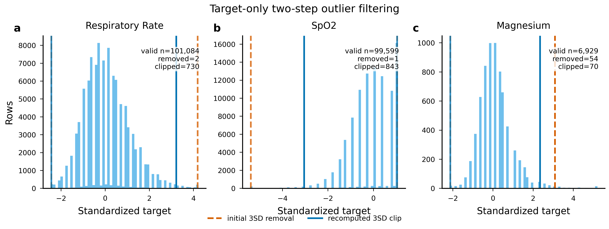
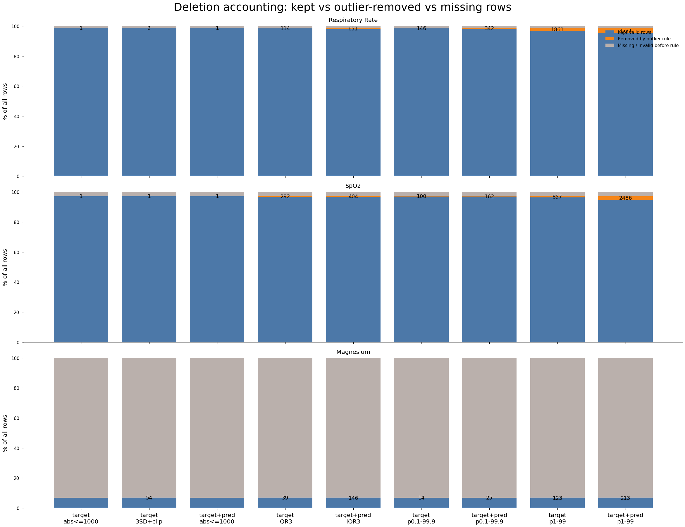
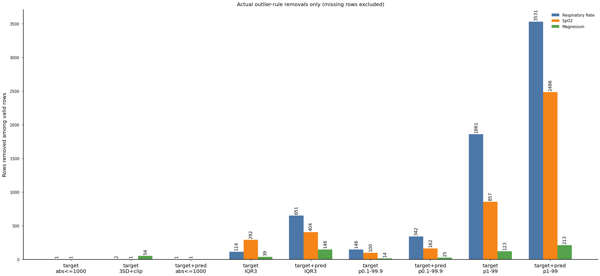
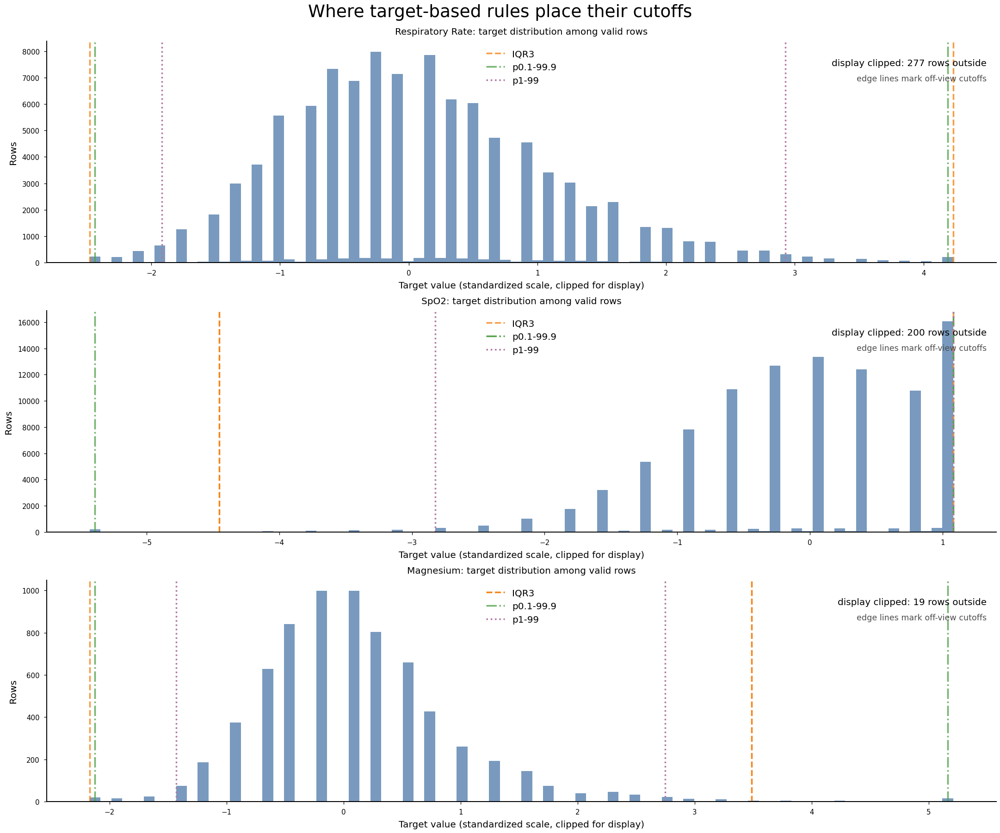

<!-- TARGET_TWO_STEP_FILTER:START -->
# Target-only two-step outlier filtering

這是目前主檢查要看的 target-based 規則，不使用 prediction value 來決定 outlier boundary。

流程：

- Step 1: 對 target values 計算 mean ± 3 SD，先移除超過這個範圍的 target rows。
- Step 2: 在 Step 1 保留下來的 target values 上重新計算 mean 和 SD。
- Step 3: 對 Step 1 保留下來但超過重新計算後 mean ± 3 SD 的 target values 做 clipping；這一步不刪 row。

| variable | valid rows | removed in step 1 | removed % | clipped in step 2 | clipped % among kept |
| --- | ---: | ---: | ---: | ---: | ---: |
| Respiratory Rate | 101,084 | 2 | 0.002 | 730 | 0.722 |
| SpO2 | 99,599 | 1 | 0.001 | 843 | 0.846 |
| Magnesium | 6,929 | 54 | 0.779 | 70 | 1.018 |



## 重新計算後的 step-level sMAE

這裡的 metric 使用同一套 target-only two-step 規則：

1. 先用 target values 計算 initial mean ± 3 SD，移除超出範圍的 target rows。
2. 在保留下來的 target values 上重新計算 mean 和 SD。
3. 對保留下來但超出 recomputed mean ± 3 SD 的 target values 做 clipping。
4. prediction value 只用於計算 error，不參與 outlier boundary。

| variable | rows used | removed step 1 | clipped step 2 | sMAE, standardized scale | sMAE / recomputed SD |
| --- | ---: | ---: | ---: | ---: | ---: |
| Respiratory Rate | 101,082 | 2 | 730 | 0.636713 | 0.604971 |
| SpO2 | 99,598 | 1 | 843 | 0.569190 | 0.572814 |
| Magnesium | 6,875 | 54 | 70 | 0.431016 | 0.565611 |

整體結果：

- Unweighted mean sMAE, standardized scale: **0.545639**
- Weighted mean sMAE, standardized scale: **0.597497**
- Unweighted mean sMAE divided by recomputed SD: **0.581132**
- Weighted mean sMAE divided by recomputed SD: **0.588236**

## DT-GPT 論文式 correlation preservation R2

依照 `plot/r2_metric_definitions.md`，DT-GPT 論文式 `R2_corr` 是比較 true pairwise correlation vector 和 predicted pairwise correlation vector：

```text
R2_corr = 1 - sum((c_true - c_pred)^2) / sum((c_true - mean(c_true))^2)
```

這不是 scatter-style `corr(c_true, c_pred)^2`。在這份 3-variable MIMIC 結果中，pairwise correlation 只有 3 個點，所以 strict `R2_corr` 對單一 pair 的偏差非常敏感。

| pair | rows | true corr | pred corr | diff |
| --- | ---: | ---: | ---: | ---: |
| Respiratory Rate vs SpO2 | 98,237 | -0.129728 | -0.157883 | -0.028155 |
| Respiratory Rate vs Magnesium | 6,675 | -0.005193 | 0.030751 | 0.035944 |
| SpO2 vs Magnesium | 6,612 | -0.020572 | -0.035905 | -0.015333 |

結果：

- Strict DT-GPT paper-style `R2_corr`: **0.748408**
- 參考用 scatter-style `corr(true_corr, pred_corr)^2`: **0.942399**

## 數據現象解釋

- Respiratory Rate 的第一步 SD 被兩個巨大 target outliers 拉大；移除後重新計算 SD，才會有 730 筆進入 clipping。
- SpO2 第一階段只移除 1 筆，但重算 SD 後有 843 筆被 clipping。
- Magnesium 第一階段移除 54 筆，第二階段 clipping 70 筆；Magnesium 少很多 row 的主要原因仍然是原本 valid target/prediction pair 少，不是 prediction-based deletion。
- sMAE 在 standardized scale 上，Magnesium 最低，Respiratory Rate 最高；但除以 recomputed SD 後三個變數更接近，代表 Magnesium 的 recomputed target SD 明顯比較小，會把 normalized error 放大。
- Target clipping 後的 true correlation 結構改變很明顯，尤其 Respiratory Rate vs SpO2 的 true correlation 從接近 0 變成更負。prediction correlation 方向一致但幅度仍有偏差，所以 strict `R2_corr` 提升到 0.748408，但沒有達到 paper-like 0.99。
- scatter-style `corr^2 = 0.942399` 比 strict `R2_corr` 高，是因為它只看三個 pair 的線性排列趨勢；strict `R2_corr` 會直接懲罰每個 pair 的絕對偏差，因此比較嚴格。
<!-- TARGET_TWO_STEP_FILTER:END -->

# Outlier 刪除方法圖表總覽

本檔案整理 job `40131` 的 outlier deletion analysis。這裡最重要的是把三種情況分開：

- **保留下來的有效資料**：有 target，也有 prediction，最後有拿來算 metric。
- **真的被 outlier rule 刪掉的資料**：原本是有效資料，但因為超出規則門檻被移除。
- **missing / invalid 資料**：一開始就沒有完整 target 或 prediction，所以本來就不能拿來算該變數的 metric。

最重要結論：

> Magnesium 看起來少了九萬多筆，不是因為 IQR3 刪掉九萬多筆，而是因為 Magnesium 本來就有大量 missing / invalid row。  
> `target_iqr3` 對 Magnesium 真正刪掉的有效資料只有 **39 筆**。

---

## 圖 1：整體資料去向



這張圖把每個變數、每種刪除方法下的資料分成三類：

- 藍色：保留下來的有效資料
- 橘色：真的被 outlier rule 刪掉的有效資料
- 灰色：missing / invalid，本來就不能拿來算 metric

怎麼看：

- Respiratory Rate 和 SpO2 大部分資料都是藍色，代表有效資料很多。
- Magnesium 大部分是灰色，代表大多數 row 沒有 Magnesium 的有效 target/prediction。
- Magnesium 的橘色很小，代表 outlier rule 並沒有大量刪掉 Magnesium 的有效資料。

白話解釋：

> 這張圖是在說：「資料不見了」不一定等於「被 outlier rule 刪掉」。  
> Magnesium 的主要問題是 missing 多，不是 IQR3 刪太多。

---

## 圖 2：只看真正被 outlier rule 刪掉的資料



這張圖把 missing / invalid row 排除，只看每種方法真正刪掉多少有效資料。

| 方法 | Respiratory Rate | SpO2 | Magnesium |
|---|---:|---:|---:|
| `target_abs_le_1000` | 1 | 1 | 0 |
| `target_iqr3` | 114 | 292 | 39 |
| `target_and_pred_iqr3` | 651 | 404 | 146 |
| `target_p1_99` | 1861 | 857 | 123 |
| `target_and_pred_p1_99` | 3531 | 2486 | 213 |

怎麼看：

- `target_abs_le_1000` 很保守，只刪掉明顯不可能的極端 target。
- `target_iqr3` 會刪多一點，但仍然不是大量刪除。
- `target_and_pred_iqr3` 會再多刪一些，因為它連 prediction 太極端也刪。
- `target_p1_99` 和 `target_and_pred_p1_99` 最嚴格，刪最多。

白話解釋：

> 這張圖才是真正回答「哪個方法刪掉多少資料」。  
> 如果要做正式主結果，`target_abs_le_1000` 比較保守；IQR3 和 percentile trimming 比較適合當 sensitivity analysis。

---

## 圖 3：不同 rule 的 cutoff 切在哪裡



這張圖顯示每個變數的 target 分布，以及不同 target-based rule 的刪除界線。

圖中的直線代表：

- `IQR3`：用 Q1/Q3 和 3 倍 IQR 算出的統計門檻。
- `p0.1-99.9`：只保留第 0.1 到第 99.9 百分位之間的資料。
- `p1-99`：只保留第 1 到第 99 百分位之間的資料，更嚴格。

怎麼看：

- 線越靠近中間，代表刪得越嚴格。
- 線越靠近兩端，代表刪得越保守。
- 對 ICU 資料來說，極端值不一定是錯，可能是真實重症病人，所以不能只靠統計門檻決定正式刪除。

白話解釋：

> 這張圖是在看每個刪除方法的「刀」切在哪裡。  
> p1-99 切得比較靠近中間，所以刪比較多；IQR3 通常比較保守，但仍可能刪掉臨床上真實的極端病人。

---

## 總結

可以這樣解釋：

> 我們把資料分成三種：保留、真的被 outlier rule 刪掉、以及原本就 missing/invalid。  
> 圖表顯示，Magnesium 少很多資料主要是因為 missing，不是因為 IQR3 刪掉九萬多筆。  
> 如果只看真正被 outlier rule 刪掉的有效資料，`target_iqr3` 對 Magnesium 只刪 39 筆。  
> 因此，IQR3 可以當作敏感度分析，但正式主結果最好使用更保守、可被臨床合理性支持的 outlier rule，例如只刪明顯不可能的 target values。
