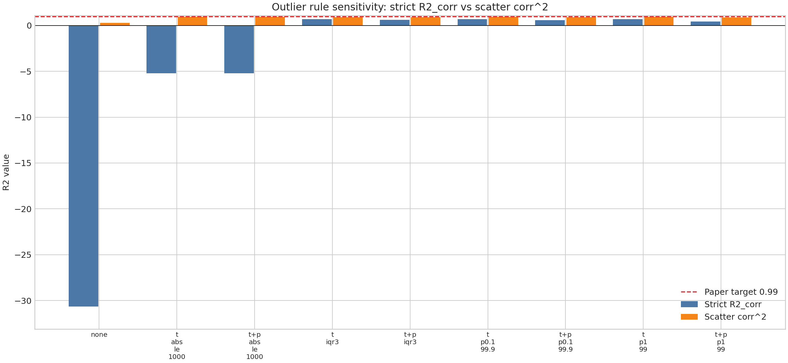
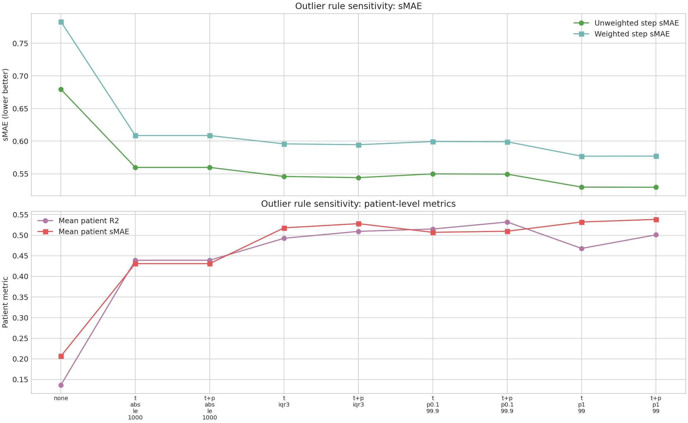

# Outlier Sensitivity Analysis — MIMIC DoRA job 40131, 30 samples

Source logs: `logs/mimic_dora_paper_r2_vllm_shard_40131_*.out`. All 8 shards completed and saved target/prediction CSVs.

This file compares R2, R2-corr, and sMAE under several outlier-removal rules. The previously reported local rule is `target_abs_le_1000`.

## Rule summary

| rule                        |   r2_corr_definition_diagonal |   r2_corr_scatter_fit_corr_squared |   step_smae_unweighted |   step_smae_weighted |   mean_patient_r2 |   mean_patient_smae |
|:----------------------------|------------------------------:|-----------------------------------:|-----------------------:|---------------------:|------------------:|--------------------:|
| none                        |                    -30.6366   |                           0.257812 |               0.679367 |             0.783041 |          0.13677  |            0.206793 |
| target_abs_le_1000          |                     -5.21711  |                           0.924896 |               0.559732 |             0.608527 |          0.439173 |            0.431049 |
| target_and_pred_abs_le_1000 |                     -5.21711  |                           0.924896 |               0.559732 |             0.608527 |          0.439173 |            0.431049 |
| target_iqr3                 |                      0.691803 |                           0.909459 |               0.545888 |             0.59581  |          0.492479 |            0.517813 |
| target_and_pred_iqr3        |                      0.603291 |                           0.891143 |               0.544054 |             0.594497 |          0.509241 |            0.52794  |
| target_p0.1_99.9            |                      0.681706 |                           0.921904 |               0.549832 |             0.59944  |          0.514898 |            0.506922 |
| target_and_pred_p0.1_99.9   |                      0.561066 |                           0.887249 |               0.549399 |             0.59899  |          0.531903 |            0.509617 |
| target_p1_99                |                      0.66162  |                           0.92324  |               0.529568 |             0.57692  |          0.467907 |            0.532013 |
| target_and_pred_p1_99       |                      0.407001 |                           0.874081 |               0.529326 |             0.577096 |          0.500805 |            0.538283 |

## Interpretation

- `target_abs_le_1000` removes the known impossible target outlier(s), but does **not** remove extreme prediction values.
- `target_and_pred_abs_le_1000` is almost identical here, so there are no prediction values beyond ±1000 driving the result.
- IQR / percentile trimming can make patient R2 and sMAE look better, but it does **not** recover paper-level `R2_corr ~= 0.99` under the strict definition.
- The highest scatter-style correlation among these rules is shown in `r2_corr_scatter_fit_corr_squared`; this is not the same formula as `plot/r2_metric_definitions.md`'s strict `R2_corr`.

## Correlation-pair details for the standard outlier rule (`target_abs_le_1000`)

| pair                          |   rows |   true_corr |   pred_corr |      diff |
|:------------------------------|-------:|------------:|------------:|----------:|
| Respiratory Rate vs SpO2      |  98238 |   -0.066436 |   -0.157892 | -0.091455 |
| Respiratory Rate vs Magnesium |   6728 |   -0.010806 |    0.022072 |  0.032877 |
| SpO2 vs Magnesium             |   6665 |   -0.039346 |   -0.026024 |  0.013322 |

## Patient metrics for the standard outlier rule (`target_abs_le_1000`)

| variable         |   patients |   r2_patient |   raw_mae |   true_patient_avg_std |     smae |
|:-----------------|-----------:|-------------:|----------:|-----------------------:|---------:|
| Respiratory Rate |       5520 |     0.510057 |  0.368719 |               0.79129  | 0.465972 |
| SpO2             |       5507 |     0.477341 |  0.357433 |               0.858514 | 0.416339 |
| Magnesium        |       4322 |     0.33012  |  0.395696 |               0.963151 | 0.410835 |

## Step metrics for the standard outlier rule (`target_abs_le_1000`)

| variable         |   rows |   removed_rows |   r2_step |     smae |
|:-----------------|-------:|---------------:|----------:|---------:|
| Respiratory Rate | 101083 |           1486 |  0.103775 | 0.647648 |
| SpO2             |  99598 |           2971 |  0.286384 | 0.579725 |
| Magnesium        |   6929 |          95640 |  0.381289 | 0.451821 |
| Unweighted mean  | 207610 |                |           | 0.559732 |
| Weighted mean    | 207610 |                |           | 0.608527 |

## Files

- `outlier_sensitivity_summary_40131_30sample.csv`
- `outlier_sensitivity_step_metrics_40131_30sample.csv`
- `outlier_sensitivity_patient_metrics_40131_30sample.csv`
- `outlier_sensitivity_correlation_metrics_40131_30sample.csv`
- `outlier_sensitivity_bounds_40131_30sample.csv`
- `outlier_sensitivity_extreme_values_40131_30sample.csv`

<!-- CHINESE_SUMMARY_AND_FIGURES:START -->
---

## 中文解讀與圖表

這份 outlier sensitivity analysis 的目的，是確認 paper-R2 差距是不是主要由極端值造成。結論是：**outlier 確實影響很大，但只靠移除 outlier 仍不足以重現 paper 的 `R2 ≈ 0.99`。**

### 主要觀察

- 不做任何過濾時：嚴格 `R2_corr = -30.636624`，scatter-style `corr^2 = 0.257812`。
- 標準規則 `target_abs_le_1000` 後：嚴格 `R2_corr = -5.217115`，scatter-style `corr^2 = 0.924896`。
- 嚴格 `R2_corr` 最好的規則是 `target_iqr3`，得到 `0.691803`。
- scatter-style `corr^2` 最好的規則是 `target_abs_le_1000`，得到 `0.924896`。

### Outlier 規則比較表

| rule                        |   r2_corr_definition_diagonal |   r2_corr_scatter_fit_corr_squared |   step_smae_unweighted |   step_smae_weighted |   mean_patient_r2 |   mean_patient_smae |
|:----------------------------|------------------------------:|-----------------------------------:|-----------------------:|---------------------:|------------------:|--------------------:|
| none                        |                    -30.6366   |                           0.257812 |               0.679367 |             0.783041 |          0.13677  |            0.206793 |
| target_abs_le_1000          |                     -5.21711  |                           0.924896 |               0.559732 |             0.608527 |          0.439173 |            0.431049 |
| target_and_pred_abs_le_1000 |                     -5.21711  |                           0.924896 |               0.559732 |             0.608527 |          0.439173 |            0.431049 |
| target_iqr3                 |                      0.691803 |                           0.909459 |               0.545888 |             0.59581  |          0.492479 |            0.517813 |
| target_and_pred_iqr3        |                      0.603291 |                           0.891143 |               0.544054 |             0.594497 |          0.509241 |            0.52794  |
| target_p0.1_99.9            |                      0.681706 |                           0.921904 |               0.549832 |             0.59944  |          0.514898 |            0.506922 |
| target_and_pred_p0.1_99.9   |                      0.561066 |                           0.887249 |               0.549399 |             0.59899  |          0.531903 |            0.509617 |
| target_p1_99                |                      0.66162  |                           0.92324  |               0.529568 |             0.57692  |          0.467907 |            0.532013 |
| target_and_pred_p1_99       |                      0.407001 |                           0.874081 |               0.529326 |             0.577096 |          0.500805 |            0.538283 |

### 圖表

**圖 1.** 各種 outlier removal 規則對 `R2_corr` 的影響。紅色虛線是 paper 目標值 `0.99`。更嚴格的 IQR / percentile trimming 可以讓嚴格 `R2_corr` 變正，但仍到不了 0.99。

**圖 2.** 各種 outlier removal 規則對 step-level sMAE、patient R2、patient sMAE 的影響。整體來看，去除極端值會降低 sMAE，並改善 patient-level 指標。

### 白話結論

- **Outlier 是問題的一部分**：完全不過濾時，嚴格 `R2_corr` 非常差。
- **標準 outlier rule 足以讓 sMAE 接近 paper 區間**，但不足以讓嚴格 `R2_corr` 接近 0.99。
- **如果 paper 使用的是 scatter fit / correlation-squared 類型指標**，目前最接近的值約 `0.924896`；但若使用 `plot/r2_metric_definitions.md` 的嚴格公式，最高也只有 `0.691803`。
<!-- CHINESE_SUMMARY_AND_FIGURES:END -->
